# Service Topology Diagram

```mermaid
graph TB
    subgraph Internet
        USER[User / Browser]
    end

    subgraph "Reverse Proxy (systemd)"
        NGINX[nginx :80/:443<br/>Wildcard SSL]
    end

    subgraph "Authentication"
        OAUTH[OAuth2 Proxy :4180<br/>Google Provider]
    end

    USER --> NGINX
    NGINX -->|auth_request| OAUTH
    OAUTH -->|authenticated| NGINX

    subgraph "Core Media"
        PLEX[Plex :32400]
        SONARR[Sonarr :8989]
        RADARR[Radarr :7878]
        PROWLARR[Prowlarr :9696]
        BAZARR[Bazarr :6767]
        LIDARR[Lidarr :8686]
    end

    subgraph "Download Clients"
        NZBGET[NZBGet :6789]
        QBIT_VPN[qBittorrent-VPN :8090<br/>OpenVPN Kill Switch]
        QBIT_MAM[qBittorrent-MAM :8092]
        UNPACKERR[Unpackerr<br/>Auto-extract]
        MAM_IRC[MAM-IRC<br/>Bonus Points]
    end

    subgraph "Book Management"
        READARR1[Readarr :8787<br/>User 1 Ebooks]
        READARR_A1[Readarr-Audio :8788<br/>User 1 Audiobooks]
        READARR2[Readarr2 :8789<br/>User 2 Ebooks]
        READARR_A2[Readarr-Audio2 :8790<br/>User 2 Audiobooks]
        CALIBRE1[Calibre :8083<br/>User 1]
        CALIBRE2[Calibre2 :8085<br/>User 2]
        CWEB1[Calibre-Web :8087<br/>User 1]
        CWEB2[Calibre-Web2 :8088<br/>User 2]
        ABS[Audiobookshelf :13378]
    end

    subgraph "AI Services"
        SUB_WEB[Subgeneratorr Web :5000]
        SUB_WORKER[Subgeneratorr Worker]
        SUB_REDIS[Redis :6379]
    end

    subgraph "Management & Monitoring"
        DASH[Dashboard :3400]
        PORT[Portainer :9444]
        TAUT[Tautulli :8182]
        GLANCES[Glances :8383]
        FBROWSER[FileBrowser :8089]
        WETTY[WeTTY :3002]
        FIRECRAWL[Firecrawl UI :8093]
        WATCH[WUD<br/>Thu 8 AM digest]
    end

    subgraph "Notifications"
        NOTIFIARR[Notifiarr :5454]
        TRAILARR[Trailarr :7889]
        PULSARR[Pulsarr :3003]
        DBOT[Discord Bot<br/>6 Cogs]
        TDIGEST[Tautulli Digest :8078]
        WEBHOOK[Webhook Proxy :8079]
        TWILIO[Twilio SMS :3300]
    end

    subgraph "Systemd Services"
        AUTOADD1[calibre-autoadd-watcher<br/>User 1]
        AUTOADD2[calibre-autoadd-watcher<br/>User 2]
        SEASON[sonarr-season-limiter]
    end

    %% Media Acquisition Flow
    PROWLARR -->|indexers| SONARR
    PROWLARR -->|indexers| RADARR
    PROWLARR -->|indexers| READARR1
    PROWLARR -->|indexers| READARR2
    PROWLARR -->|indexers| READARR_A1
    PROWLARR -->|indexers| READARR_A2
    PROWLARR -->|indexers| LIDARR

    SONARR -->|download requests| NZBGET
    SONARR -->|download requests| QBIT_VPN
    RADARR -->|download requests| NZBGET
    RADARR -->|download requests| QBIT_VPN

    READARR1 -->|download requests| NZBGET
    READARR1 -->|download requests| QBIT_MAM
    READARR2 -->|download requests| NZBGET
    READARR2 -->|download requests| QBIT_MAM
    READARR_A1 -->|download requests| NZBGET
    READARR_A2 -->|download requests| NZBGET

    UNPACKERR -->|monitors| SONARR
    UNPACKERR -->|monitors| RADARR
    UNPACKERR -->|monitors| READARR1
    UNPACKERR -->|monitors| READARR_A1
    UNPACKERR -->|monitors| READARR2
    UNPACKERR -->|monitors| READARR_A2

    %% Book Pipeline
    AUTOADD1 -->|copies to autoadd| CALIBRE1
    AUTOADD2 -->|copies to autoadd| CALIBRE2
    CALIBRE1 --> CWEB1
    CALIBRE2 --> CWEB2

    %% Plex Integration
    SONARR -->|imports| PLEX
    RADARR -->|imports| PLEX
    BAZARR -->|subtitles| PLEX
    TAUT -->|monitors| PLEX
    PULSARR -->|watchlist sync| SONARR
    PULSARR -->|watchlist sync| RADARR
    SEASON -->|limits seasons| SONARR

    %% AI Subtitle Flow
    SUB_WEB --> SUB_REDIS
    SUB_WORKER --> SUB_REDIS

    %% Notifications
    NOTIFIARR -->|monitors| SONARR
    NOTIFIARR -->|monitors| RADARR
    NOTIFIARR -->|monitors| READARR1
    NOTIFIARR -->|monitors| PLEX
    NOTIFIARR -->|monitors| BAZARR
    TRAILARR -->|trailers for| RADARR
    TRAILARR -->|trailers for| SONARR

    %% Dashboard
    DASH -->|reads from| GLANCES
    DASH -->|reads from| TAUT
    DASH -->|reads from| SONARR
    DASH -->|reads from| RADARR
    DASH -->|reads from| NZBGET


    %% Discord Bot
    DBOT -->|manages| READARR1
    DBOT -->|manages| SONARR
    DBOT -->|manages| RADARR

    %% nginx routes to all services
    NGINX --> PLEX
    NGINX --> SONARR
    NGINX --> RADARR
    NGINX --> PROWLARR
    NGINX --> BAZARR
    NGINX --> DASH
    NGINX --> PORT
    NGINX --> TAUT
    NGINX --> GLANCES
    NGINX --> FBROWSER
    NGINX --> WETTY

    %% Styling
    classDef media fill:#4a9eff,stroke:#333,color:#fff
    classDef download fill:#ff6b6b,stroke:#333,color:#fff
    classDef book fill:#51cf66,stroke:#333,color:#fff
    classDef ai fill:#cc5de8,stroke:#333,color:#fff
    classDef mgmt fill:#ffd43b,stroke:#333,color:#000
    classDef notify fill:#ff922b,stroke:#333,color:#fff
    classDef systemd fill:#868e96,stroke:#333,color:#fff
    classDef auth fill:#20c997,stroke:#333,color:#fff
    classDef proxy fill:#339af0,stroke:#333,color:#fff

    class PLEX,SONARR,RADARR,PROWLARR,BAZARR,LIDARR media
    class NZBGET,QBIT_VPN,QBIT_MAM,UNPACKERR,MAM_IRC download
    class READARR1,READARR_A1,READARR2,READARR_A2,CALIBRE1,CALIBRE2,CWEB1,CWEB2,ABS book
    class SUB_WEB,SUB_WORKER,SUB_REDIS ai
    class DASH,PORT,TAUT,GLANCES,FBROWSER,WETTY,FIRECRAWL,WATCH mgmt
    class NOTIFIARR,TRAILARR,PULSARR,DBOT,TDIGEST,WEBHOOK,TWILIO notify
    class AUTOADD1,AUTOADD2,SEASON systemd
    class OAUTH auth
    class NGINX proxy
```

## Legend

| Color | Category |
|-------|----------|
| Blue | Core Media Services |
| Red | Download Clients |
| Green | Book Management |
| Purple | AI Services |
| Yellow | Management & Monitoring |
| Orange | Notifications & Integration |
| Gray | Systemd Services |
| Teal | Authentication |
